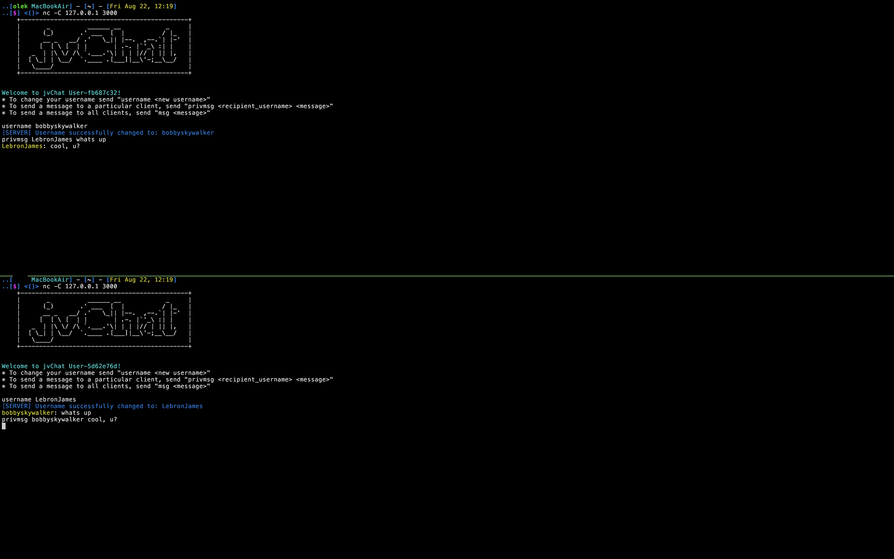

# 🗣️ jvChat — Lightweight Java TCP Chat Server
A tiny, dependency-light chat server written in pure Java with ANSI-colored console output.
Comes with a minimal command set and tests for the command parser.

## Overview
jvChat is a simplistic server, which allows multiple client to connect and chat with multiple
clients. Its features include:

### 🎮 User commands:
- Username setup (username)
- Private messages (privmsg)
- Global messages (msg)

### 👾 Internal features:

- Client event handlers on individual threads
- tinylog logging interface

## ⚙️ Requirements & setup
- Java 17+
- Gradle 8+ (wrapper included: ./gradlew)
- A terminal that supports ANSI colors (Linux/macOS, Windows Terminal)

### 1) Build
```bash
./gradlew clean build
````
### 2) Run via Gradle
```bash
# pass port as the first & only argument
./gradlew run --args="5050"
```
### 3) Connect with netcat
```bash
nc 127.0.0.1 <port>
```

## 📷 Preview



## 🗒️ Notes
This is my first project in Java, feel free to enhance it :)

## License
```
Copyright (c) 2025 bobbyskywalker

Permission is hereby granted, free of charge, to any person obtaining a copy
of this software and associated documentation files (the "Software"), to deal
in the Software without restriction, including without limitation the rights
to use, copy, modify, merge, publish, distribute, sublicense, and/or sell
copies of the Software, and to permit persons to whom the Software is
furnished to do so, subject to the following conditions:

The above copyright notice and this permission notice shall be included in all
copies or substantial portions of the Software.

THE SOFTWARE IS PROVIDED "AS IS", WITHOUT WARRANTY OF ANY KIND, EXPRESS OR
IMPLIED, INCLUDING BUT NOT LIMITED TO THE WARRANTIES OF MERCHANTABILITY,
FITNESS FOR A PARTICULAR PURPOSE AND NONINFRINGEMENT. IN NO EVENT SHALL THE
AUTHORS OR COPYRIGHT HOLDERS BE LIABLE FOR ANY CLAIM, DAMAGES OR OTHER
LIABILITY, WHETHER IN AN ACTION OF CONTRACT, TORT OR OTHERWISE, ARISING FROM,
OUT OF OR IN CONNECTION WITH THE SOFTWARE OR THE USE OR OTHER DEALINGS IN THE
SOFTWARE.
```
